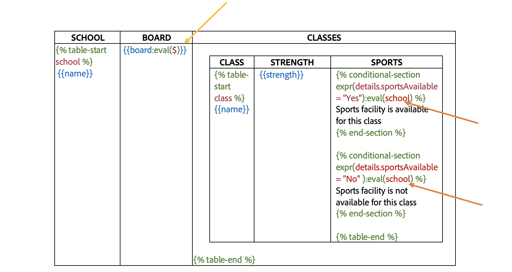
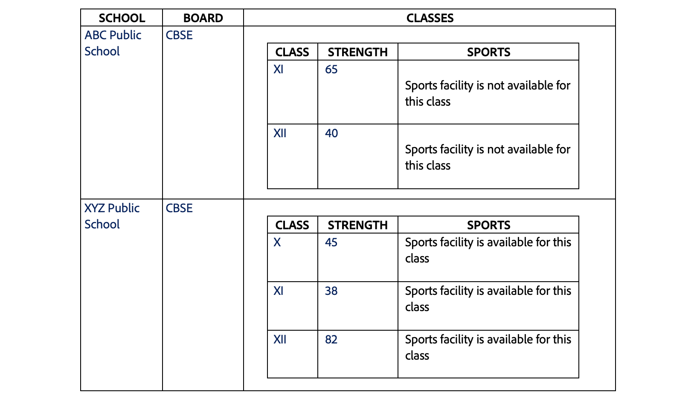

# Table Tag with Markers
Use Table markers to insert table tags in a document

There are two constructs introduced to insert tables inside a document called **Table Markers**. Table Markers will be used to create the table tags inside the document.

- table-start ``
- table-end   ``

**How to use** <br/>
- In the table row that needs to be dynamically expanded, place the `table-start` marker in the first cell and the `table-end` marker in the last cell of the row.
- The `table-start` marker requires an array field (ARRAY_FIELD), which will be used to create the rows/columns in the table depending on the orientation of the table.
- The content between these markers is then dynamically populated by iterating over the array of objects corresponding to the tag(ARRAY_FIELD) specified in the `table-start` marker.

JSON representation of the input data:

```json
{
  "school": [
    {
      "name": "ABC Public School",
      "strength": "128",
      "address": "New Delhi"
    },
    {
      "name": "DEF Public School",
      "strength": "83",
      "address": "Hyderabad"
    },
    {
      "name": "XYZ Public School",
      "strength": "165",
      "address": "Mumbai"
    }
  ]
}

```


In the above example, **school** serves as the ARRAY_FIELD over whose data the table is populated. A new row is created for each
school and data are filled in accordingly.

## Nested Tables
Table tags with markers can also be used inside another table to create nested tables.

JSON representation of the input data:

```json
{
  "Board" : "CBSE",
  "school": [
    {

      "name": "ABC Public School",
      "Details": {
        "Contact" : "9XXXXXXXX8",
        "Address": "New Delhi",
        "Transport": true,
        "Faculty": {
          "Teacher": 30,
          "Staff": 20
        }
      },
      "class": [
        {
          "name" : "XI",
          "strength": 65
        },
        {
          "name" : "XII",
          "strength": 40
        }
      ]
    },
    {
      "name": "XYZ Public School",
      "Details": {
        "Contact" : "7XXXXXXXX5",
        "Address": "Mumbai",
        "Transport": true,
        "Faculty": {
          "Teacher": 21,
          "Staff": 12
        }
      },
      "class": [
        {
          "name" : "X",
          "strength": 45
        },
        {
          "name" : "XI",
          "strength": 38
        },
        {
          "name" : "XII",
          "strength": 82
        }
      ]
    }
  ]
}

```


Create both tables with their respective table markers. In the above example, the **school** tag acts as the array
upon which the outer table is expanded. For each school, the inner table is expanded on its respective **class** tag,
which is mentioned as the array field in the inner table marker.

If you need to use data present in one of the outer tables, mention the context in which the data is present using
**eval** construct along with the tag. In the above example the **contact** tag is present in school but is needed to be populated
in the **class** table, so we add the **school** tag in the eval construct of the tag.

<InlineAlert slots="text"/>

- Nested Tables are only supported using the `Table Markers`.
- Array Field of `table-start` in the inner table should be the nested field of the array field used in the `table-start` marker of the outer table.
- The eval construct can take the values of the **ARRAY_FIELD** of the outer tables as arguments, or it can take the special argument **$**, in which case the tag will be evaluated in the context of the input JSON.

Similarly, if a condition needs to be evaluated on data outside the current table, add the context for the same using the **eval** construct.



- In the above example, we've used the **eval** construct with the `Board` tag. As specified earlier $ indicates that the context is input json itself. So, as mentioned in the input json, the tag will be replaced
  by its value **CBSE**.

- We've also used the **eval** construct with conditions. In the above examples, both the conditions indicated have `school`
  as context. So the conditional expressions will be evaluated in the context of the corresponding `school`.



<InlineAlert slots="text"/>

- If **eval** construct is not used with a condition, it is evaluated in the context of the current table being expanded.
- **eval** construct for conditions also supports the same arguments as that of text tags.

## Complex Table Constructs with Table markers

Complex table constructs can also be used along with table markers(`table-start`, `table-end`). Below are the examples depicting their usage.

## Dynamically expand table rows or columns
Specify the cell extension property in any tag inside the table cell to indicate whether to expand table rows
vertically or columns horizontally.

```json
{
  "subscriptions": [
    {
      "name": "Adobe Document API",
      "price": "99"
    },
    {
      "name": "Adobe Marketing API",
      "price": "199"
    },
    {
      "name": "Adobe Design API",
      "price": "299"
    }

  ]
}
```


- **Repeat table rows vertically with table markers** - To use vertical extension with table markers, add *cell-extension(vertical)* to a tag.


- **Repeat table columns horizontally with table markers** - To use horizontal extension with table markers, add *cell-extension(horizontal)*
  to a tag and place the table start and end markers at the beginning and end of the column instead of the row.


## Dynamic table columns
Discard a column or set of columns in a table from the final generated document using table markers.

### Discard column if empty
Columns in a table can be discarded if every element of an array in the input json is empty or null.

**How to use** <br/>
Add a discard-if-empty construct with a boolean false/true along with the template tag to activate discard if empty feature for the corresponding column.

JSON representation of the input data:

```json
{
  "Project": [
    {
      "Name": "ABC Infra",
      "Milestone": "First Milestone",
      "DateComplete": "24/06/2021",
      "Notes": ""
    },
    {
      "Name": "ABC Infra",
      "Milestone": "Second Milestone",
      "DateComplete": "24/06/2022",
      "Notes": ""
    },
    {
      "Name": "DEF Computer Labs",
      "Milestone": "First Milestone",
      "DateComplete": "12/12/2021",
      "Notes": ""
    },
    {
      "Name": "DEF Computer Labs",
      "Milestone": "Second Milestone",
      "DateComplete": "12/12/2021",
      "Notes": ""
    }
  ]
}
```


### Discard column if the condition evaluates to true
Column in a table can be discarded if the condition provided in the discard-if(expr(**condition**)) evaluates to true for
any entry in the array of objects.

**How to use** <br/>
Add discard-if(expr(**condition**)) construct along with the template tag to activate the discard-if feature for the corresponding column.

**Note:** discard-if construct can also take a context input as discard-if(expr(**condition**), **context_tag**). In this case the `condition`
will be evaluated in the context of `context_tag`.

JSON representation of the input data:

```json
{
  "Conversion": [
    {
      "Month": "July, 2021",
      "Rate": 10,
      "Method": "Payout by Cheque"
    },
    {
      "Month": "September, 2021",
      "Rate": 30,
      "Method": "Payout by Cheque"
    },
    {
      "Month": "Dec, 2021",
      "Rate": 20,
      "Method": "Payout by Cheque"
    },
    {
      "Month": "April, 2022",
      "Rate": 20,
      "Method": "Payout by Cheque"
    },
    {
      "Month": "Dec, 2022",
      "Rate": 30,
      "Method": "Payout by Cheque"
    }
  ]
}
```


In the above example, we've used discard-if along with context **$**($ here indicates that the context is the input json itself).
So, in this case, the conditions will be evaluated in the context of input json.

## Dynamic table rows
Discard a row or set of rows in a table from the final generated document.

### Discard the row if the condition evaluates to true
A row in the table can be discarded only when the condition in the discard-row-if(expr(**condition**)) evaluates
to true in the provided context. Add this construct along with the template tag to discard the row based on the provided condition.

For Example: {{PROPERTY:**discard-row-if(expr(condition))**}}

**Note:** We can also use context in a similar way to discard-if, as {{PROPERTY:**discard-row-if(expr(condition),context_tag)**}}.

JSON representation of the input data:
```json
{
  "Conversion": [
    {
      "Month": "July, 2021",
      "Rate": 10,
      "Method": "Payout by Cheque"
    },
    {
      "Month": "Dec, 2021",
      "Rate": 20,
      "Method": "Payout by Cheque"
    },
    {
      "Month": "Dec, 2022",
      "Rate": 40,
      "Method": "Payout by Cheque"
    },
    {
      "Month": "Dec, 2021",
      "Rate": 80,
      "Method": "Payout by Cheque"
    },
    {
      "Month": "April, 2022",
      "Rate": 100,
      "Method": "Payout by Cash"
    },
    {
      "Month": "Dec, 2022",
      "Rate": 45,
      "Method": "Payout by Cheque"
    }
  ]
}
```


