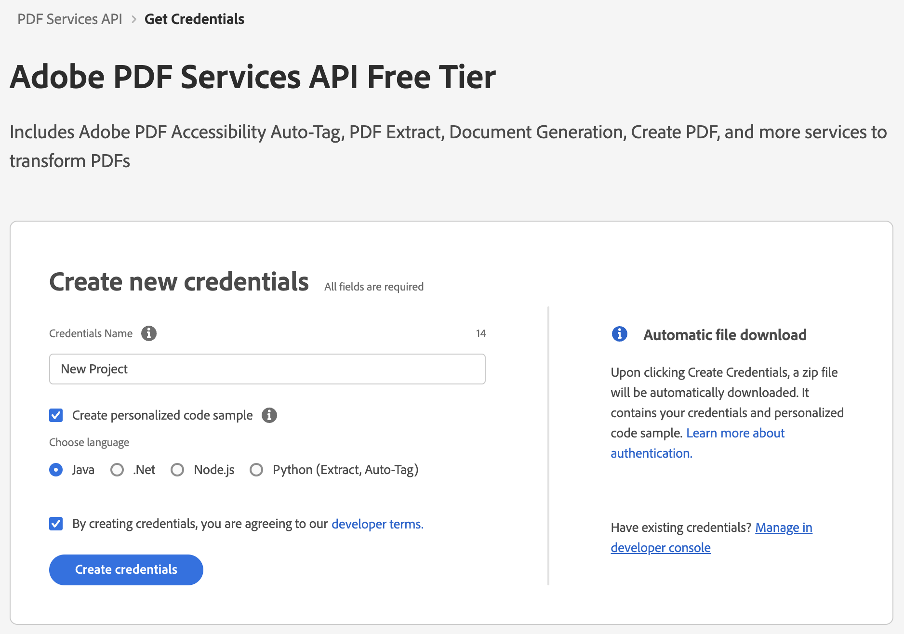
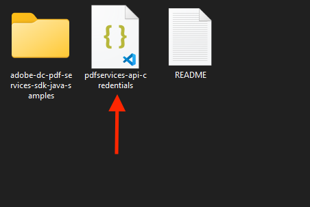

# Quickstart for Adobe PDF Services API (Java)

To get started using Adobe PDF Services API, let's walk through a simple scenario - taking an input PDF document and exporting it to Microsoft Word. In this guide, we will walk you through the complete process for creating a program that will accomplish this task. 

## Prerequisites

To complete this guide, you will need:

* [Java](http://www.oracle.com/technetwork/java/javase/downloads/index.html) - Java 11 or higher is required. 
* [Maven](https://maven.apache.org/install.html)
* An Adobe ID. If you do not have one, the credential setup will walk you through creating one.
* A way to edit code. No specific editor is required for this guide.

## Step One: Getting credentials

1) To begin, open your browser to <https://acrobatservices.adobe.com/dc-integration-creation-app-cdn/main.html?api=pdf-services-api>. If you are not already logged in to Adobe.com, you will need to sign in or create a new user. Using a personal email account is recommend and not a federated ID.


2) After registering or logging in, you will then be asked to name your new credentials. Use the name, "New Project". 

3) Change the "Choose language" setting to "Java". 

4) Also note the checkbox by, "Create personalized code sample." This will include a large set of samples along with your credentials. These can be helpful for learning more later. 

5) Click the checkbox saying you agree to the developer terms and then click "Create credentials."



6) After your credentials are created, they are automatically downloaded:


## Step Two: Setting up the project

1) In your Downloads folder, find the ZIP file with your credentials: PDFServicesSDK-JavaSamples.zip. If you unzip that archive, you will find a folder of samples and the `pdfservices-api-credentials.json` file.



2) Take the `pdfservices-api-credentials.json` and place it in a new directory.

3) In this directory, create a new file named `pom.xml` and copy the following content:

```xml
<?xml version="1.0" encoding="UTF-8"?>

<project xmlns="http://maven.apache.org/POM/4.0.0"
         xmlns:xsi="http://www.w3.org/2001/XMLSchema-instance"
         xsi:schemaLocation="http://maven.apache.org/POM/4.0.0 http://maven.apache.org/xsd/maven-4.0.0.xsd">
  <modelVersion>4.0.0</modelVersion>

  <groupId>com.adobe.documentservices</groupId>
  <artifactId>pdfservices-sdk-samples</artifactId>
  <version>${pdfservices.sdk.samples.version}</version>

  <name>PDF Services Java SDK Samples</name>

  <properties>
    <project.build.sourceEncoding>UTF-8</project.build.sourceEncoding>
    <maven.compiler.source>11</maven.compiler.source>
    <maven.compiler.target>11</maven.compiler.target>
    <pdfservices.sdk.version>4.0.0</pdfservices.sdk.version>
    <pdfservices.sdk.samples.version>4.0.0</pdfservices.sdk.samples.version>
  </properties>

  <dependencies>

    <dependency>
      <groupId>com.adobe.documentservices</groupId>
      <artifactId>pdfservices-sdk</artifactId>
      <version>${pdfservices.sdk.version}</version>
    </dependency>

    <!--		log4j2 dependency to showcase the use of log4j2 with slf4j API-->
    <!-- https://mvnrepository.com/artifact/org.slf4j/slf4j-log4j12 -->
    <dependency>
      <groupId>org.apache.logging.log4j</groupId>
      <artifactId>log4j-slf4j-impl</artifactId>
      <version>2.21.1</version>
    </dependency>
  </dependencies>

  <build>
    <plugins>
      <plugin>
        <groupId>org.apache.maven.plugins</groupId>
        <artifactId>maven-compiler-plugin</artifactId>
        <version>3.8.0</version>
        <configuration>
          <source>${maven.compiler.source}</source>
          <target>${maven.compiler.target}</target>
        </configuration>
      </plugin>
      <plugin>
        <groupId>org.codehaus.mojo</groupId>
        <artifactId>exec-maven-plugin</artifactId>
        <version>1.5.0</version>
        <executions>
          <execution>
            <goals>
              <goal>java</goal>
            </goals>
          </execution>
        </executions>
      </plugin>
    </plugins>
  </build>
</project>
```

This file will define what dependencies we need and how the application will be built. 

Our application will take a PDF, `Bodea Brochure.pdf` (downloadable from <a href="https://documentcloud.adobe.com/view-sdk-demo/PDFs/Bodea Brochure.pdf">here</a>) and convert it to a Microsoft Word document, `Bodea Brochure.docx`.

4) In your editor, open the directory where you previously copied the credentials, and create a new directory, `src/main/java`. In that directory, create `ExportPDFToWord.java`. 

5) In your editor, open the directory where you previously copied the credentials, and create a new directory, `output`. This directory will hold the results of the operation.

Now you're ready to begin coding.

## Step Three: Creating the application

1) We'll begin by including our required dependencies:

```javascript
import com.adobe.pdfservices.operation.PDFServices;
import com.adobe.pdfservices.operation.PDFServicesMediaType;
import com.adobe.pdfservices.operation.PDFServicesResponse;
import com.adobe.pdfservices.operation.auth.Credentials;
import com.adobe.pdfservices.operation.auth.ServicePrincipalCredentials;
import com.adobe.pdfservices.operation.exception.SDKException;
import com.adobe.pdfservices.operation.exception.ServiceApiException;
import com.adobe.pdfservices.operation.exception.ServiceUsageException;
import com.adobe.pdfservices.operation.io.Asset;
import com.adobe.pdfservices.operation.io.StreamAsset;
import com.adobe.pdfservices.operation.pdfjobs.jobs.ExportPDFJob;
import com.adobe.pdfservices.operation.pdfjobs.params.exportpdf.ExportPDFParams;
import com.adobe.pdfservices.operation.pdfjobs.params.exportpdf.ExportPDFTargetFormat;
import com.adobe.pdfservices.operation.pdfjobs.result.ExportPDFResult;
import org.apache.commons.io.IOUtils;
import org.slf4j.Logger;
import org.slf4j.LoggerFactory;

import java.io.File;
import java.io.IOException;
import java.io.InputStream;
import java.io.OutputStream;
import java.nio.file.Files;
```

2) Now let's define our main class:

```javascript
public class ExportPDFToWord {

    private static final org.slf4j.Logger LOGGER = LoggerFactory.getLogger(ExportPDFToWord.class);

    public static void main(String[] args) {

	}

}
```

3) Set the environment variables `PDF_SERVICES_CLIENT_ID` and `PDF_SERVICES_CLIENT_SECRET` by running the following commands and replacing placeholders `YOUR CLIENT ID` and `YOUR CLIENT SECRET` with the credentials present in `pdfservices-api-credentials.json` file:
- **Windows:**
  - `set PDF_SERVICES_CLIENT_ID=<YOUR CLIENT ID>`
  - `set PDF_SERVICES_CLIENT_SECRET=<YOUR CLIENT SECRET>`

- **MacOS/Linux:**
  - `export PDF_SERVICES_CLIENT_ID=<YOUR CLIENT ID>`
  - `export PDF_SERVICES_CLIENT_SECRET=<YOUR CLIENT SECRET>`

4) Next, we can create our credentials and use them:

```javascript
// Initial setup, create credentials instance
Credentials credentials = new ServicePrincipalCredentials(
        System.getenv("PDF_SERVICES_CLIENT_ID"),
        System.getenv("PDF_SERVICES_CLIENT_SECRET"));

// Creates a PDF Services instance
PDFServices pdfServices = new PDFServices(credentials);
```

5) Now, let's upload the asset:

```javascript
Asset asset = pdfServices.upload(inputStream, PDFServicesMediaType.PDF.getMediaType());
```

6) Now, let's create the parameters and the job:

```javascript
// Create parameters for the job
ExportPDFParams exportPDFParams = ExportPDFParams.exportPDFParamsBuilder(ExportPDFTargetFormat.DOCX).build();

// Creates a new job instance
ExportPDFJob exportPDFJob = new ExportPDFJob(asset, exportPDFParams);
```

This set of code defines what we're doing (an Export operation), and sets parameter for the Export PDF job. In this example, the only parameter is the export format ,ie, DOCX.

7) The next code block submits the job and gets the job result:

```javascript
// Submit the job and get the job result
String location = pdfServices.submit(exportPDFJob);
PDFServicesResponse<ExportPDFResult> pdfServicesResponse = pdfServices.getJobResult(location, ExportPDFResult.class);

// Get content from the resulting asset(s)
Asset resultAsset = pdfServicesResponse.getResult().getAsset();
StreamAsset streamAsset = pdfServices.getContent(resultAsset);
```

8) The next code block saves the result at the specified location:

```javascript
// Creates an output stream and copy stream asset's content to it
OutputStream outputStream = Files.newOutputStream(new File("./Bodea Brochure.docx").toPath());
IOUtils.copy(streamAsset.getInputStream(), outputStream);
```

This code runs the Export process and then stores the result Word document to the file system. 


Here's the complete application (`src/main/java/ExportPDFToWord.java`):

```javascript
import com.adobe.pdfservices.operation.PDFServices;
import com.adobe.pdfservices.operation.PDFServicesMediaType;
import com.adobe.pdfservices.operation.PDFServicesResponse;
import com.adobe.pdfservices.operation.auth.Credentials;
import com.adobe.pdfservices.operation.auth.ServicePrincipalCredentials;
import com.adobe.pdfservices.operation.exception.SDKException;
import com.adobe.pdfservices.operation.exception.ServiceApiException;
import com.adobe.pdfservices.operation.exception.ServiceUsageException;
import com.adobe.pdfservices.operation.io.Asset;
import com.adobe.pdfservices.operation.io.StreamAsset;
import com.adobe.pdfservices.operation.pdfjobs.jobs.ExportPDFJob;
import com.adobe.pdfservices.operation.pdfjobs.params.exportpdf.ExportPDFParams;
import com.adobe.pdfservices.operation.pdfjobs.params.exportpdf.ExportPDFTargetFormat;
import com.adobe.pdfservices.operation.pdfjobs.result.ExportPDFResult;
import org.apache.commons.io.IOUtils;
import org.slf4j.Logger;
import org.slf4j.LoggerFactory;

import java.io.File;
import java.io.IOException;
import java.io.InputStream;
import java.io.OutputStream;
import java.nio.file.Files;

public class ExportPDFToWord {

    private static final Logger LOGGER = LoggerFactory.getLogger(ExportPDFToWord.class);

    public static void main(String[] args) {

        try (InputStream inputStream = Files.newInputStream(new File("src/main/resources/Bodea Brochure.pdf").toPath())) {
            // Initial setup, create credentials instance
            Credentials credentials = new ServicePrincipalCredentials(
                    System.getenv("PDF_SERVICES_CLIENT_ID"),
                    System.getenv("PDF_SERVICES_CLIENT_SECRET"));
          
            // Creates a PDF Services instance
            PDFServices pdfServices = new PDFServices(credentials);
          
            // Creates an asset(s) from source file(s) and upload
            Asset asset = pdfServices.upload(inputStream, PDFServicesMediaType.PDF.getMediaType());
          
            // Create parameters for the job
            ExportPDFParams exportPDFParams = ExportPDFParams.exportPDFParamsBuilder(ExportPDFTargetFormat.DOCX)
                    .build();
          
            // Creates a new job instance
            ExportPDFJob exportPDFJob = new ExportPDFJob(asset, exportPDFParams);
          
            // Submit the job and gets the job result
            String location = pdfServices.submit(exportPDFJob);
            PDFServicesResponse<ExportPDFResult> pdfServicesResponse = pdfServices.getJobResult(location, ExportPDFResult.class);
          
            // Get content from the resulting asset(s)
            Asset resultAsset = pdfServicesResponse.getResult().getAsset();
            StreamAsset streamAsset = pdfServices.getContent(resultAsset);
          
            // Creates an output stream and copy stream asset's content to it
            OutputStream outputStream = Files.newOutputStream(new File("output/Bodea Brochure.docx").toPath());
            IOUtils.copy(streamAsset.getInputStream(), outputStream);
        } catch (ServiceApiException | IOException | SDKException | ServiceUsageException e) {
            LOGGER.error("Exception encountered while executing operation", e);
        }
    }
}
```

## Next Steps

Now that you've successfully performed your first operation, [review the documentation](https://developer.adobe.com/document-services/docs/overview/pdf-services-api/) for many other examples and reach out on our [forums](https://community.adobe.com/t5/document-services-apis/ct-p/ct-Document-Cloud-SDK) with any questions. Also remember the samples you downloaded while creating your credentials also have many demos.
